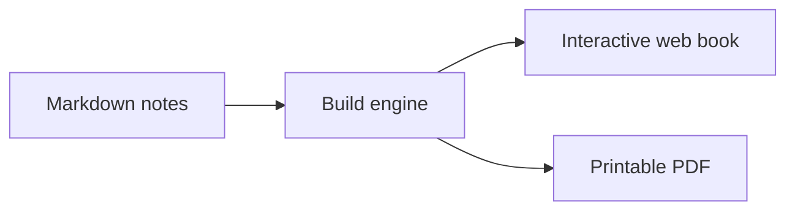

# 5. The Teaching-as-Code Philosophy

Did you know your teaching materials can be **code**? We don't mean building software applications — we mean expressing diagrams, figures, quizzes, and glossaries as structured text that a machine transforms automatically.

## What can be generated from code?

| Resource | Tool | Example |
|----------|------|---------|
| Flow diagrams | Mermaid | `graph TD --> A --> B` |
| Scientific plots | matplotlib | `plt.plot(x, y)` |
| Interactive widgets | ipywidgets | Sliders, dropdowns |
| Quizzes | MyST `{admonition}` | Questions with hidden answers |
| Glossaries | MyST `{glossary}` | Terms and definitions |
| Data tables | pandas | DataFrames as HTML tables |

## Why is this a good idea?

```{admonition} Key idea
Code-based materials are **reproducible**: you always produce the same output from the same instructions. No more "final_v3_definitive_2.pdf".
```

1. **Reproducible**: Anyone can regenerate the materials with identical results.
2. **Versionable**: Git tracks every change with its date, author, and reason.
3. **AI-modifiable**: An AI assistant can update your materials when they live in structured text, not a locked PDF.
4. **Collaborative**: Multiple professors can contribute without overwriting each other's work.

```{admonition} Tip
:class: tip
You don't need to write all the code yourself. AI assistants can generate Mermaid diagrams, matplotlib plots, and tables from your natural-language description.
```

## Quick example: a Mermaid diagram



That diagram is written in three lines of text. No PowerPoint. No dragging boxes around.

## The mindset shift

The goal is not to turn you into a programmer. The goal is for your materials to stop being closed files and become **living documents** that evolve with your course, that can be improved with AI help, and that any colleague can reuse.
