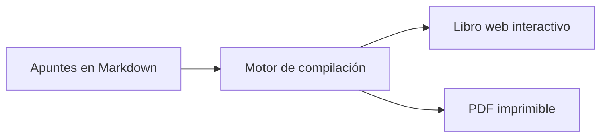

# 5. La Filosofía del Código Docente

¿Sabías que tus materiales didácticos pueden ser **código**? No hablamos de programar aplicaciones, sino de expresar diagramas, figuras, cuestionarios y glosarios como texto estructurado que una máquina puede transformar automáticamente.

## ¿Qué puede generarse desde código?

| Recurso | Herramienta | Ejemplo |
|---------|------------|---------|
| Diagramas de flujo | Mermaid | `graph TD --> A --> B` |
| Gráficas científicas | matplotlib | `plt.plot(x, y)` |
| Widgets interactivos | ipywidgets | Deslizadores, menús |
| Cuestionarios | MyST `{admonition}` | Preguntas con respuesta oculta |
| Glosarios | MyST `{glossary}` | Términos y definiciones |
| Tablas de datos | pandas | DataFrames como tablas HTML |

## ¿Por qué es una buena idea?

```{admonition} Idea clave
Un material en código es **reproducible**: siempre produces el mismo resultado desde las mismas instrucciones. No hay "versión final_v3_definitiva_2.pdf".
```

1. **Reproducible**: Cualquiera puede regenerar los materiales con los mismos resultados.
2. **Versionable**: Git guarda cada cambio con su fecha, autor y motivo.
3. **Modificable por IA**: Un asistente de IA puede actualizar tus materiales si están en texto estructurado, no en un PDF cerrado.
4. **Colaborativo**: Varios profesores pueden contribuir sin sobreescribir el trabajo ajeno.

```{admonition} Consejo
:class: tip
No necesitas escribir todo el código tú mismo. Los asistentes de IA pueden generar diagramas Mermaid, gráficas matplotlib y tablas a partir de tu descripción en lenguaje natural.
```

## Ejemplo rápido: un diagrama con Mermaid



Ese diagrama se escribe en tres líneas de texto. Sin abrir PowerPoint. Sin arrastrar cajas.

## El cambio de mentalidad

La idea no es que te conviertas en programadora o programador. La idea es que tus materiales dejen de ser archivos cerrados y pasen a ser **documentos vivos** que evolucionan con tu asignatura, que pueden mejorarse con ayuda de IA y que cualquier colega puede reutilizar.
